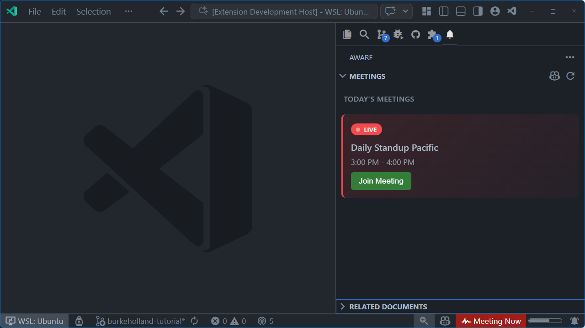

# Aware

AI-powered meeting and document awareness for VS Code that integrates with Microsoft 365 via the Work IQ MCP server to keep you in the loop.



## Prerequisites

This extension requires:

1. **GitHub Copilot** - Active subscription with the GitHub Copilot extension installed
2. **Microsoft 365 Copilot License** - Required for each user accessing Work IQ
3. **Work IQ MCP Server** - Must be configured in VS Code (see setup below)
4. **Admin Consent** - Your organization's admin must grant consent for Work IQ ([Admin Guide](https://github.com/microsoft/work-iq-mcp/blob/main/ADMIN-INSTRUCTIONS.md))

### Developer / Packaging Prerequisites

- Node.js and npm installed
- `vsce` (recommended use via `npx vsce` or install globally with `npm i -g @vscode/vsce`)
- A working TypeScript toolchain (installed via `npm install` in this repo)

### Work IQ MCP Server Setup

The extension uses [Microsoft Work IQ](https://github.com/microsoft/work-iq-mcp) to access your Microsoft 365 calendar data.

**Quick Install (recommended):**

[Install Work IQ in VS Code](https://vscode.dev/redirect/mcp/install?name=workiq&config=%7B%22command%22%3A%22npx%22%2C%22args%22%3A%5B%22-y%22%2C%22%40microsoft%2Fworkiq%22%2C%22mcp%22%5D%7D)

**Manual Configuration:**

Add to your VS Code MCP settings:

```json
{
  "workiq": {
    "command": "npx",
    "args": ["-y", "@microsoft/workiq", "mcp"]
  }
}
```

**First-time setup:**

```bash
# Accept the EULA (required on first use)
npx @microsoft/workiq accept-eula
```

> **Note:** Work IQ is in Public Preview. Features and APIs may change.

## Building and Packaging (repeatable steps)

Follow these steps to build, package, and install the extension locally. Use `npx vsce` if you prefer not to install `vsce` globally.

1. Install dependencies

```bash
npm install
```

2. Compile TypeScript (there is no `build` script — use `compile`)

```bash
npm run compile
# or for development with incremental rebuilds:
npm run watch
```

3. Package the extension (recommended: use `npx` to avoid a global install)

```bash
npx vsce package
# or, if you installed vsce globally:
# vsce package
```

This produces `aware-<version>.vsix` in the repository root.

4. Install the packaged extension into VS Code

```bash
code --install-extension aware-0.0.2.vsix
```

Troubleshooting tips
- If `vsce` reports a missing dependency (for example `missing: @vscode/codicons@^0.0.44`), run `npm install` in the repository root to ensure `node_modules` is present. If the dependency is absent from `package.json`, add it with:

```bash
npm install @vscode/codicons@^0.0.44 --save
```

- If you tried `npm run build` and saw `Missing script: "build"`, use `npm run compile` as shown above.
- Prefer `npx vsce package` to avoid managing a global `vsce` install.

Example full flow

```bash
npm install
npm run compile
npx vsce package
code --install-extension aware-0.0.2.vsix
```


## Features

### Meeting Awareness
- **Automatic Calendar Sync**: Uses the Work IQ MCP server to fetch your upcoming meetings from Microsoft 365
- **Meeting Reminders**: Get notified before meetings start (configurable reminder time)
- **Status Bar Integration**: See your next meeting at a glance in the VS Code status bar
- **One-Click Join**: Join online meetings directly from VS Code

### Copilot Integration
- **@aware Chat Participant**: Chat with `@aware` to manage your meetings
  - `/meetings` - Show your upcoming meetings
  - `/next` - See when your next meeting is

- **Language Model Tools**: Copilot can use these tools to help you:
  - `aware_getMeetings` - Get all meetings (including in-progress) for today, tomorrow, or the week
  - `aware_getNextMeeting` - Get current meeting (if in progress) and next upcoming meeting details

### Sidebar Views
- **Meetings**: A rich webview showing all your meetings with visual status indicators
  - **Happening Now** - Meetings currently in progress with "Live" badge and red accent
  - **Starting Soon** - Meetings within the next 15 minutes with orange accent
  - **Later Today** - All other upcoming meetings for today
  - **Tomorrow** - Preview of tomorrow's meetings
  - Click any online meeting to join directly
- **Related Documents**: See M365 documents related to your current workspace

## Requirements

| Requirement | Details |
|-------------|--------|
| VS Code | 1.108.1 or later |
| GitHub Copilot | Required for chat participant and language model tools |
| Microsoft 365 Copilot | License required for Work IQ access |
| Work IQ MCP Server | See [Prerequisites](#prerequisites) for setup |
| Node.js | Required for npx to run Work IQ |

## Extension Settings

This extension contributes the following settings:

| Setting | Default | Description |
|---------|---------|-------------|
| `aware.meetingReminderMinutes` | `10` | Minutes before a meeting to show a reminder notification |
| `aware.refreshIntervalMinutes` | `5` | How often to refresh the meeting list from your calendar |
| `aware.preferredModel` | `""` | Preferred language model for the Aware assistant. Use `Aware: Select Model` to choose. |
| `aware.showStatusBar` | `true` | Show Aware status in the status bar |
| `aware.enableNotifications` | `true` | Enable meeting reminder notifications |
| `aware.workingHoursStart` | `09:00` | Start of working hours (HH:MM format) |
| `aware.workingHoursEnd` | `17:00` | End of working hours (HH:MM format) |

## Commands

| Command | Description |
|---------|-------------|
| `Aware: Show Upcoming Meetings` | Display your upcoming meetings in a quick pick |
| `Aware: Refresh Meetings` | Refresh the meeting list from your calendar |
| `Aware: Refresh Related Documents` | Refresh documents related to your current workspace |
| `Aware: Join Meeting` | Join the current or next online meeting |
| `Aware: Select Language Model` | Choose which AI model Aware uses |
| `Aware: Add Work IQ MCP Server` | Add the Work IQ MCP server to your settings |
| `Aware: Open Settings` | Open Aware settings |

## How It Works

1. **Calendar Integration**: The extension uses the Work IQ MCP server to query your Microsoft 365 calendar for upcoming meetings.

2. **Meeting Tracking**: Meetings are cached locally and refreshed at configurable intervals. The extension tracks meeting status (upcoming, in progress, ended).

3. **Notifications**: When a meeting is approaching (based on `meetingReminderMinutes`), you'll receive a notification with options to join or dismiss.

4. **Copilot Integration**: Use `@aware` in Copilot Chat to interact with your calendar using natural language.

## Known Issues

- Work IQ requires a Microsoft 365 Copilot license; the extension will show an error if the MCP server is not configured
- Some meeting properties may not be available depending on your Microsoft 365 configuration

## Troubleshooting

**"Work IQ MCP server not available" error:**
1. Ensure Work IQ is installed: `npx @microsoft/workiq version`
2. Accept the EULA: `npx @microsoft/workiq accept-eula`
3. Verify MCP configuration in VS Code settings
4. Check that your organization has granted admin consent

**Meetings not loading:**
1. Verify your Microsoft 365 Copilot license is active
2. Make sure that you are on a VPN if required for your org, etc.
3. Try running `What are my meetings today"` in Copilot chat to test

## Release Notes

### 0.0.2
- Screenshot added to README
- That's pretty much it

### 0.0.1

- Initial release
- Meeting tracking and reminders
- @aware chat participant with /meetings and /next commands
- Language model tools for Copilot
- Sidebar views for meetings and related documents
- Status bar integration

---

**Stay aware, stay on schedule!**
